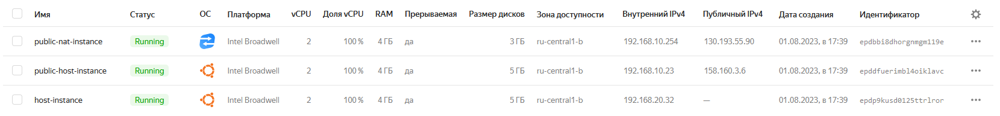
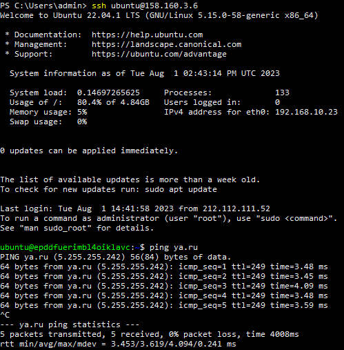
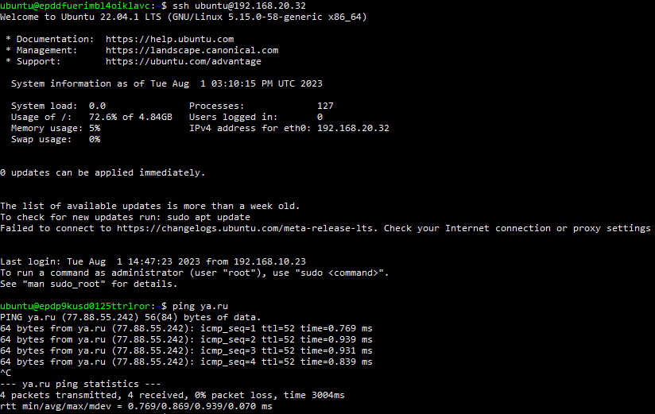

# Домашнее задание к занятию «Организация сети» Соловьев Д.В.
Все terraform файлы расположены в [директории "terraform"](./terraform/).  
Итоги выполнения команды ```terraform apply```:  
  
  
Подключение к public-host-instance по публичному IP и проверка соединения с интернетом:  
  
Подключение к host-instance в private сети по внутреннему IP и проверка соединения с интернетом:  
